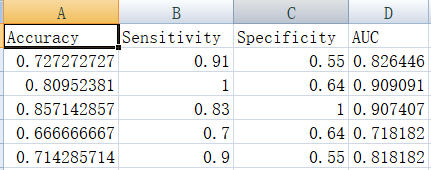
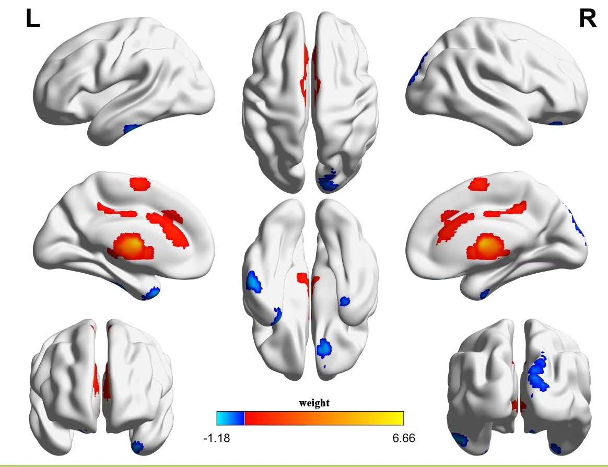
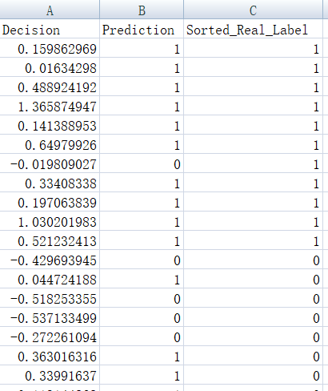

# easylearn   
Easylearn is designed for machine learning in resting-state fMRI field.   
- Our mission is to enable everyone who wants to apply machine learning to their research field to apply machine learning in the simplest way.  
- Our goal is to develop a graphical interface so that researchers who are not familiar with programming can easily apply machine learning to their fields.  

# Core Dependencies 
The follows will be automatically install if you use "pip install -U easylearn" command    

- sklearn
- numpy
- pandas
- python-dateutil
- pytz
- scikit-learn
- scipy
- six
- nibabel
- imbalanced-learn
- skrebate
- matplotlib

# Install  
```
pip install -U easylearn
```

# Development   
At present, the project is in the development stage  
We hope you can join us!

# Supervisor   
##### Ke Xu
>kexu@vip.sina.com  
>The First Affiliated Hospital, China Medical University. 
##### Yong He  
>yong.he@bnu.edu.cn  
>1 National Key Laboratory of Cognitive Neuroscience and Learning, Beijing Normal University, Beijing 100875, China  
>2 Beijing Key Laboratory of Brain Imaging and Connectomics, Beijing Normal University, Beijing 100875, China  
>3 IDG/McGovern Institute for Brain Research, Beijing Normal University, Beijing 100875, China 
##### Tang Yanqing  
>yanqingtang@163.com  
>The First Affiliated Hospital, China Medical University.        
##### Fei Wang  
>fei.wang@yale.edu  
>The First Affiliated Hospital, China Medical University.   

# Maintainer    
##### Chao Li; 
>lichao19870617@gmail.com   
>The First Affiliated Hospital, China Medical University.      
##### Mengshi Dong  
>dongmengshi1990@163.com  
>The First Affiliated Hospital, China Medical University.    
##### Shaoqiang Han
>867727390@qq.com  
>The First Affiliated Hospital of ZhengZhou University
##### Lili Tang
>lilyseyo@gmail.com  
>The First Affiliated Hospital, China Medical University.    
##### Ning Yang  
>1157663200@qq.com  
>Guangdong Second Provincial General Hospital  
##### Peng Zhang
>1597403028@qq.com  
>South China Normal University 
##### Weixiang Liu  
>wxliu@szu.edu.cn  
>Shenzhen University        


# Demo
The simplest demo is in the eslearn/examples.  
Below is a demo of training a model to classify insomnia patients using weighted functional connectivity strength as features (You can easily use other voxel-wise metrics as features, such as ReHo, ALFF).
This demo use svc as classifier, Principal Component Analysis (PCA) as dimension reduction method and Recursive feature elimination (RFE) as feature selection method (inner cross-validation).
In each fold, this program will uper-sampling the training dataset to balance the cases with +1 labels and 0 labels.

```
import numpy as np
import eslearn.machine_learning.classfication.pca_rfe_svc_cv as pca_rfe_svc

# =============================================================================
# All inputs
path_patients = r'D:\WorkStation_2018\Workstation_Old\WorkStation_2018-05_MVPA_insomnia_FCS\Degree\degree_gray_matter\Zdegree\Z_degree_patient\Weighted'  # All patients' image files, .nii format
path_HC = r'D:\WorkStation_2018\Workstation_Old\WorkStation_2018-05_MVPA_insomnia_FCS\Degree\degree_gray_matter\Zdegree\Z_degree_control\Weighted'  # All HCs' image files, .nii format
path_mask = r'G:\Softer_DataProcessing\spm12\spm12\tpm\Reslice3_TPM_greaterThan0.2.nii'  # Mask file for filter image
path_out = r'D:\WorkStation_2018\Workstation_Old\WorkStation_2018-05_MVPA_insomnia_FCS\Degree\degree_gray_matter\Zdegree'  # Directory for saving results
data_preprocess_method='StandardScaler'
data_preprocess_level='group'  # In which level to preprocess data 'subject' or 'group'
num_of_fold_outer=5  # How many folds to perform cross validation
is_dim_reduction=1  # Whether to perform dimension reduction, default is using PCA to reduce the dimension.
components=0.95   # How many percentages of the cumulatively explained variance to be retained. This is used to select the top principal components.
step=0.1  # RFE parameter: percentages or number of features removed each iteration.
num_fold_of_inner_rfeCV=5  # RFE parameter:  how many folds to perform inner RFE loop.
n_jobs=-1  # RFE parameter:  how many jobs (parallel works) to perform inner RFE loop.
is_showfig_finally=True  # Whether show results figure finally.
is_showfig_in_each_fold=False  # Whether show results in each fold.
# =============================================================================

clf = pca_rfe_svc.PcaRfeSvcCV(
        path_patients=path_patients,
        path_HC=path_HC,
        path_mask=path_mask,
        path_out=path_out,
        data_preprocess_method=data_preprocess_method,
        data_preprocess_level=data_preprocess_level,
        num_of_fold_outer=num_of_fold_outer,  # How many folds to perform cross validation (Default: 5-fold cross validation)
        is_dim_reduction=is_dim_reduction,  # Default is using PCA to reduce the dimension.
        components=components, 
        step=step,
        num_fold_of_inner_rfeCV=num_fold_of_inner_rfeCV,
        n_jobs=n_jobs,
        is_showfig_finally=is_showfig_finally,  # Whether show results figure finally.
        is_showfig_in_each_fold=is_showfig_in_each_fold  # Whether show results in each fold.
    )

results = clf.main_function()
results = results.__dict__

print(f"mean accuracy = {np.mean(results['accuracy'])}")
print(f"std of accuracy = {np.std(results['accuracy'])}")
print(f"mean sensitivity = {np.mean(results['sensitivity'])}")
print(f"std of sensitivity = {np.std(results['sensitivity'])}")
print(f"mean specificity = {np.mean(results['specificity'])}")
print(f"std of specificity = {np.std(results['specificity'])}")
print(f"mean AUC = {np.mean(results['AUC'])}")
print(f"std of AUC = {np.std(results['AUC'])}")
```
<br> <br />
When the program runs successfully, some results file will be generated under the results folder (path_out), as follows:
#### <center> Classification performances </center>
  
<br> <br />
#### <center>Classification performances (text, each row are results of one fold of the 5-fold cross-validation)</center>
  
<br> <br />
#### <center>Classfication weights (top 1%, BrainNet Viewer) </center>
 
<br> <br />
#### <center>Predicted decision, predicted label and real label</center>
  

